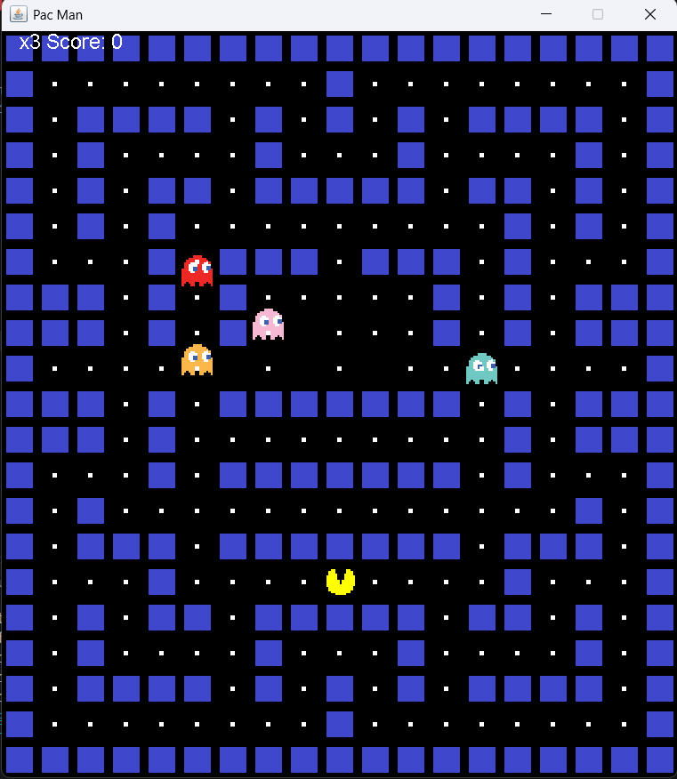

# 👾 Pacman Game in Java

An interactive 2D Pacman game built from scratch using **Java AWT** and **Swing** graphics components. This project features a custom-designed fully-enclosed maze layout, smooth collision detection, and classic arcade mechanics.



---

## 🚀 Key Features & Implementation
- **Custom Closed Maze:** A newly engineered 21x19 tilemap layout with completely closed side boundaries to keep action focused inside the arena.
- **Game Engine & Loop:** Utilizes Java Swing timer loops for high-FPS rendering and smooth movement.
- **Ghost AI & Collision:** Automated ghost movement algorithms with precise bounding-box collision detection for eating food pellets and handling life resets.
- **Score Tracker:** Live running score display integrated into the UI frame.

---

## 🛠️ How to Run Locally

### Prerequisites
- Java Development Kit (**JDK 8** or higher installed).
- Any Java IDE (VS Code, IntelliJ IDEA, Eclipse) or Command Line.

### Execution Steps
1. Clone this repository to your local computer:
   ```bash
   git clone [https://github.com/vikramsingh-04/pacman_game.git](https://github.com/vikramsingh-04/pacman_game.git)